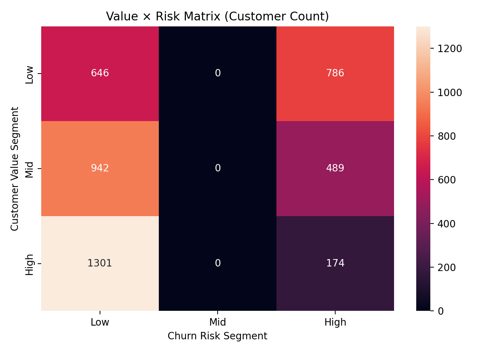
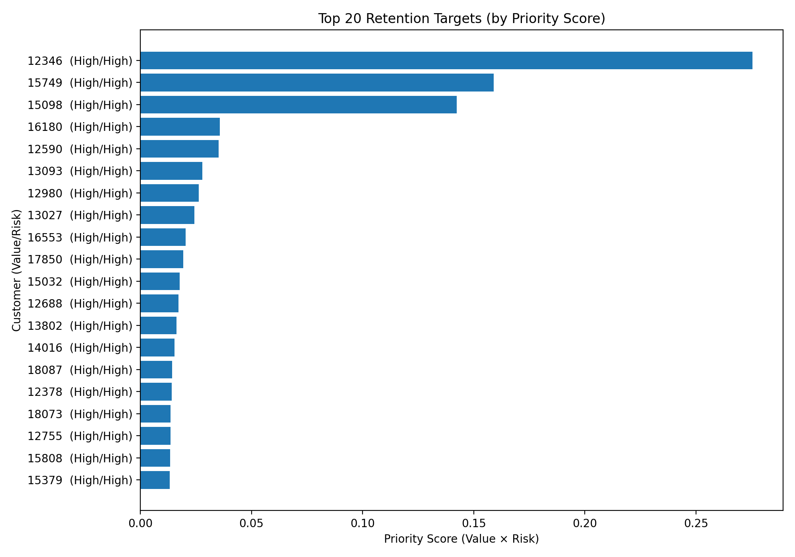

# E-commerce Churn Intelligence

## Business Problem
In e-commerce, customer inactivity often leads to silent churn and future revenue loss.  
The key challenge is not predicting churn itself, but **deciding which customers should be prioritized for retention actions**.

This project addresses the question:

> Which valuable e-commerce customers are at risk of churn, and how should retention efforts be prioritized?

---

## Solution Overview
I built an end-to-end **Customer Churn Intelligence pipeline** using transactional e-commerce data.

The system:
- defines churn using a **business proxy** (customer inactivity)
- engineers behavioral features from transaction history
- predicts churn risk using a supervised ML model
- combines **customer value and churn risk**
- outputs **clear retention recommendations**

This approach reflects how real-world **CDP / MarTech systems** support marketing and CRM decision-making.

---

## Churn Definition
Since e-commerce data does not include an explicit churn label, churn is defined as:

> **Customer is considered churned if no purchase was made in the last 90 days.**

This inactivity-based definition is a common business proxy used in retail retention analytics.

---

## Data
- Source: Kaggle – Online Retail (UK)
- Type: Transactional e-commerce data
- Key fields:
  - CustomerID
  - InvoiceDate
  - InvoiceNo
  - Quantity
  - UnitPrice

All processing is performed locally.

---

## Feature Engineering
Customer-level features include:

### Core behavioral features
- Recency (days since last purchase)
- Frequency (number of orders)
- Monetary value (total and average spend)

### Time-window activity features
- Orders and spend in last 30 / 60 / 90 days
- Activity decay indicators (trend features)

These features capture **early warning signals of churn**, not just static behavior.

---

## Modeling
- Problem type: Binary classification (churn vs non-churn)
- Model: Logistic Regression (baseline, interpretable)
- Output: **Churn probability score** per customer

The model is treated as a **scoring component**, not the final product.

---

## Decision Layer (Key Value)
The final output is a **decision-oriented customer table**, combining:

- Churn risk (probability score)
- Customer value segment
- Priority score (Value × Risk)
- Recommended retention action

Example actions:
- Priority retention (high value + high risk)
- Targeted discount campaign
- Monitoring or no action

This layer translates analytics into **clear business decisions**.

## Decisioning Visuals (MarTech / Retention)

### Value × Risk Matrix
This matrix helps prioritize retention spend by combining **customer value** with **churn risk**.

**How to use it (campaign thinking):**
- **High Value + High Risk** → priority retention (personal offer / stronger incentive)
- **Mid Value + High Risk** → scalable retention campaign (email/ads)
- **Low Risk** → regular communication, no aggressive discounts

---

### Top Retention Targets (Campaign List)
A ready-to-activate list of customers with the highest **priority score (Value × Risk)**.

This output is designed to be used as an activation list for CRM / email / paid retargeting workflows.

---

## Project Structure

ecommerce-churn-intelligence/
│
├── data/
│ └── raw/ # raw transactional data (ignored in git)
├── src/
│ ├── load_data.py # data loading & cleaning
│ ├── churn_label.py # churn definition logic
│ ├── features.py # RFM & behavioral features
│ ├── modeling.py # churn model & scoring
│ ├── decisioning.py # value-risk decision logic
│ └── run_pipeline.py # end-to-end pipeline
├── outputs/
│ ├── customer_features.csv
│ ├── churn_priority_table.csv
│ └── model_metrics.json
└── README.md

---

## Key Takeaways
- Churn prediction alone is not enough — **decision context matters**
- Combining customer value with churn risk enables **effective retention prioritization**
- This project reflects a **production-oriented mindset**, not exploratory analysis

---

## Next Steps
- Test multiple churn windows (60 / 90 / 120 days)
- Replace value proxy with predictive CLV
- Integrate campaign simulation or uplift modeling