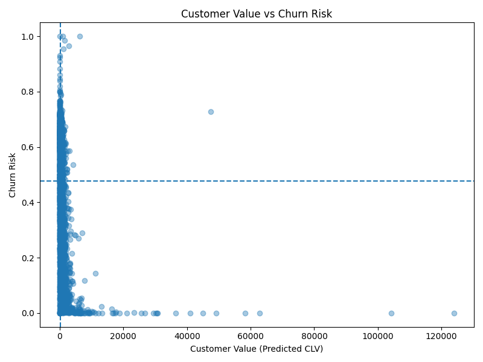

# 📊 E-commerce Churn Intelligence

End-to-end machine learning pipeline for predicting customer churn, estimating customer value, and prioritizing retention actions in e-commerce.

---

## 🚀 Project Overview

This project builds a complete churn intelligence system using transactional data from an online retail dataset.

The goal is not only to predict churn, but to identify high-value customers at risk and support business retention decisions.

---

## 🧠 Problem Statement

Customer churn is one of the biggest challenges in e-commerce.

Instead of simply predicting churn, this project answers:

- Which customers are likely to churn?
- Which customers are valuable?
- Who should be targeted first in retention campaigns?

---

## ⚙️ Pipeline Architecture

```text
Raw Data → Cleaning → Feature Engineering → Churn Labeling → Model Training → CLV Prediction → Decision Layer
```

### 1. Data Cleaning
- Removed invalid transactions
- Removed missing customers
- Parsed transaction timestamps correctly

### 2. Feature Engineering
- RFM features:
  - Recency
  - Frequency
  - Monetary value
- Time-window features:
  - Activity in last 30 / 60 / 90 days
- Trend indicators:
  - Behavioral change over time

### 3. Churn Labeling
Snapshot-based approach (no data leakage):
- Features built on historical data
- Churn defined in future 90-day window

### 4. Modeling
- Logistic Regression (scaled)
- CatBoost comparison
- Automatic model selection

### 5. CLV Prediction
Predicts future customer value using historical behavior.

### 6. Decision Layer
```text
priority_score = churn_probability × predicted_clv
```

---

## 📈 Model Performance

```text
ROC AUC: ~0.72
Accuracy: ~0.65
Precision: ~0.59
Recall: ~0.60
```

Realistic, leakage-free performance.

---

## 📊 Feature Importance


### 🔍 Interpretation

- Customer value is a strong predictor
- Recency is critical
- Declining activity signals churn risk

---

## 💰 CLV-Based Retention Priority

```text
priority_score = churn_probability × predicted_clv
```

Identifies customers who are both:
- likely to churn
- valuable

### Example Output

| CustomerID | churn_score | predicted_clv | priority_score | segment |
|---|---:|---:|---:|---|
| 15749 | 0.7285 | 47461.45 | 34575.71 | HIGH_VALUE_HIGH_RISK |
| 12346 | 1.0000 | 6316.70 | 6316.70 | HIGH_VALUE_HIGH_RISK |
| 16532 | 0.9648 | 2841.35 | 2741.31 | HIGH_VALUE_HIGH_RISK |

---

## 📊 Value vs Risk Matrix



Customers segmented by:

- Value (predicted CLV)
- Risk (churn probability)

### Interpretation

- High Value + High Risk → immediate retention target  
- High Value + Low Risk → nurture  
- Low Value + High Risk → low priority  
- Low Value + Low Risk → minimal focus  

---

## 📁 Project Structure

```text
ecommerce-churn-intelligence/
│
├── data/
│   └── raw/
│       └── Online_Retail.csv
│
├── src/
│   ├── config.py
│   ├── load_data.py
│   ├── churn_label.py
│   ├── features.py
│   ├── modeling.py
│   ├── clv.py
│   ├── decisioning.py
│   └── plots.py
│
├── outputs/
│   ├── customer_features.csv
│   ├── churn_priority_table.csv
│   ├── feature_importance.csv
│   ├── feature_importance.png
│   ├── value_risk_matrix.png
│   └── model_metrics.json
│
└── README.md
```

---

## ▶️ How to Run

```bash
pip install -r requirements.txt
python -m src.run_pipeline
```

---

## 📦 Outputs

- customer_features.csv
- churn_priority_table.csv
- feature_importance.csv
- feature_importance.png
- value_risk_matrix.png
- model_metrics.json

---

## 💡 Business Value

- Identify customers at risk
- Estimate future value
- Prioritize retention actions
- Support marketing decisions

---

## 🔗 Related Project

[Customer Lifetime Value Retail](https://github.com/Coltrane35/customer-lifetime-value-retail)

---

## 🔮 Future Improvements

- Advanced CLV models
- Campaign ROI simulation
- Dashboard (Streamlit)
- Advanced ML models

---

## 👨‍💻 Author

Grzegorz Rączka

---

## ⭐ Key Takeaway

❌ simple churn prediction  

→  

✅ actionable churn intelligence system