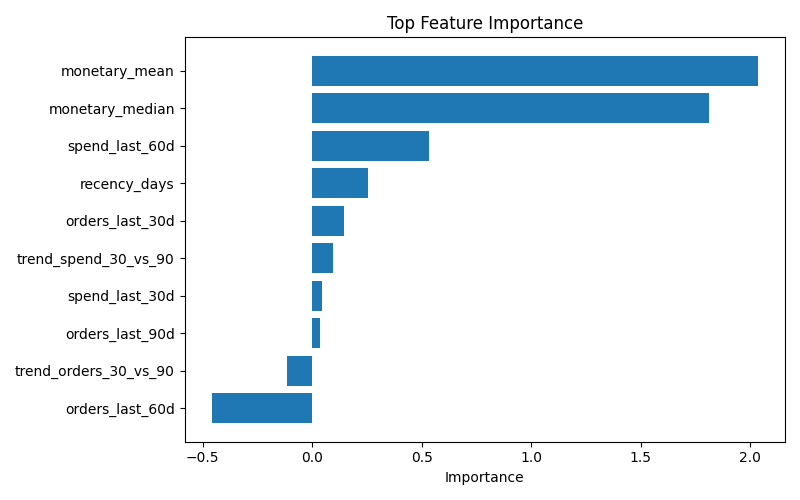

# 📊 E-commerce Churn Intelligence

End-to-end machine learning pipeline for predicting customer churn, estimating customer value, and prioritizing retention actions in e-commerce.

---

## 🚀 Project Overview

This project builds a complete churn intelligence system using transactional data from an online retail dataset.

The goal is not only to predict churn, but to identify high-value customers at risk and support business retention decisions.

---

## 🧠 Problem Statement

Customer churn is one of the biggest challenges in e-commerce.

Instead of simply predicting churn, this project answers:

- Which customers are likely to churn?
- Which customers are valuable?
- Who should be targeted first in retention campaigns?

---

## ⚙️ Pipeline Architecture

```text
Raw Data → Cleaning → Feature Engineering → Churn Labeling → Model Training → CLV Prediction → Decision Layer
```

### 1. Data Cleaning

- Removed invalid transactions
- Removed missing customers
- Parsed transaction timestamps correctly

### 2. Feature Engineering

- RFM features:
  - Recency
  - Frequency
  - Monetary value
- Time-window features:
  - Activity in last 30 / 60 / 90 days
- Trend indicators:
  - Behavioral change over time

### 3. Churn Labeling

The project uses a snapshot-based approach to avoid data leakage:

- Features are built using historical data only
- Churn is defined in a future 90-day window
- Model performance is realistic, not artificially inflated

### 4. Modeling

- Logistic Regression with scaling
- CatBoost comparison
- Automatic model selection based on ROC AUC

### 5. CLV Prediction

A simple CLV prediction layer estimates future customer value.

This allows the project to move from simple churn prediction to business prioritization.

### 6. Decision Layer

The final priority score combines churn risk and predicted customer value:

```text
priority_score = churn_probability × predicted_clv
```

---

## 📈 Model Performance

```text
ROC AUC: ~0.72
Accuracy: ~0.65
Precision: ~0.59
Recall: ~0.60
```

The model is intentionally designed to be realistic and leakage-free.

---

## 📊 Feature Importance



### 🔍 Interpretation

The model highlights several key drivers of churn:

- Customer value metrics are strong churn indicators
- Recency is important for identifying disengaged customers
- Recent activity and spending trends help detect customer decline

### 💡 Business Insight

Customers who have not purchased recently, spend less than before, or show declining activity are more likely to churn.

---

## 💰 CLV-Based Retention Priority

This project combines churn probability with predicted customer value to prioritize retention actions.

```text
priority_score = churn_probability × predicted_clv
```

This helps identify customers who are both:

- likely to churn
- valuable to the business

### Example Output

| CustomerID | churn_score | predicted_clv | priority_score | segment |
|---|---:|---:|---:|---|
| 15749 | 0.7285 | 47461.45 | 34575.71 | HIGH_VALUE_HIGH_RISK |
| 12346 | 1.0000 | 6316.70 | 6316.70 | HIGH_VALUE_HIGH_RISK |
| 16532 | 0.9648 | 2841.35 | 2741.31 | HIGH_VALUE_HIGH_RISK |

### 💡 Business Meaning

Instead of targeting every customer at risk, the decision layer helps prioritize customers where retention actions may have the highest business impact.

---

## 📁 Project Structure

```text
ecommerce-churn-intelligence/
│
├── data/
│   └── raw/
│       └── Online_Retail.csv
│
├── src/
│   ├── config.py
│   ├── load_data.py
│   ├── churn_label.py
│   ├── features.py
│   ├── modeling.py
│   ├── clv.py
│   ├── decisioning.py
│   └── plots.py
│
├── outputs/
│   ├── customer_features.csv
│   ├── churn_priority_table.csv
│   ├── feature_importance.csv
│   ├── feature_importance.png
│   └── model_metrics.json
│
└── README.md
```

---

## ▶️ How to Run

### 1. Install dependencies

```bash
pip install -r requirements.txt
```

### 2. Run pipeline

```bash
python -m src.run_pipeline
```

### 3. Outputs

Generated files:

- `customer_features.csv` — model-ready dataset
- `churn_priority_table.csv` — prioritized retention targets
- `feature_importance.csv` — explainability data
- `feature_importance.png` — feature importance visualization
- `model_metrics.json` — performance metrics

---

## 💡 Business Value

This project provides:

- Identification of customers at risk of churn
- Predicted customer value estimation
- Prioritization for retention campaigns
- Behavioral insights for marketing teams
- Foundation for data-driven retention decisions

---

## 🔗 Related Project

This project can be extended with a dedicated CLV pipeline:

[Customer Lifetime Value Retail](https://github.com/Coltrane35/customer-lifetime-value-retail)

Together, both projects form a customer retention decision engine:

- CLV model estimates customer value
- Churn model estimates churn risk
- Decision layer prioritizes customers for retention campaigns

---

## 🔮 Future Improvements

- More advanced CLV model
- ROI-based retention campaign simulation
- Streamlit dashboard
- Advanced models such as XGBoost or LightGBM
- Time-based validation

---

## 👨‍💻 Author

Grzegorz Rączka  
Machine Learning / Data Science

---

## ⭐ Key Takeaway

This project demonstrates how to move from:

❌ simple churn prediction

to:

✅ actionable churn intelligence system