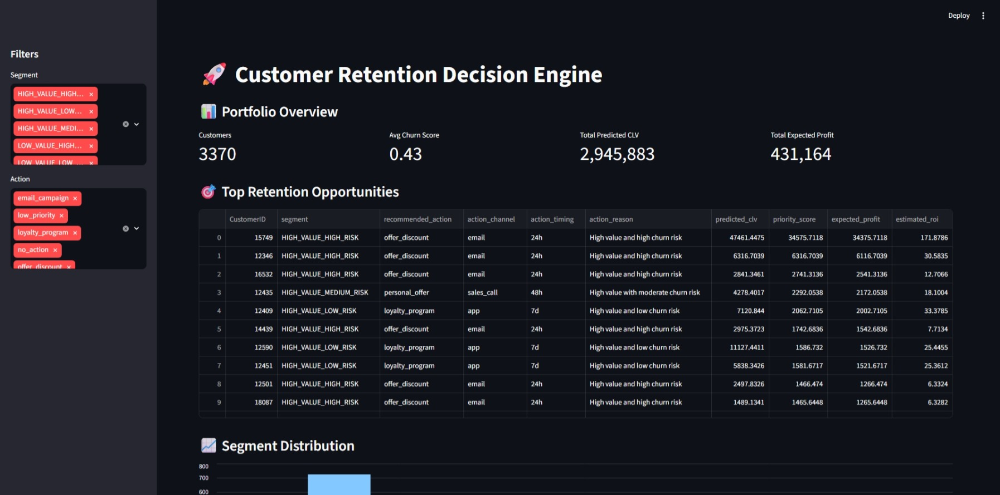
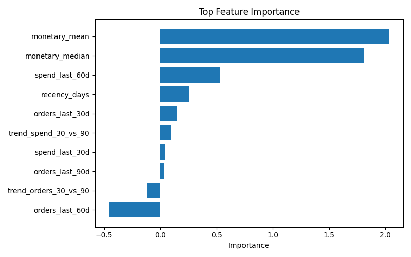
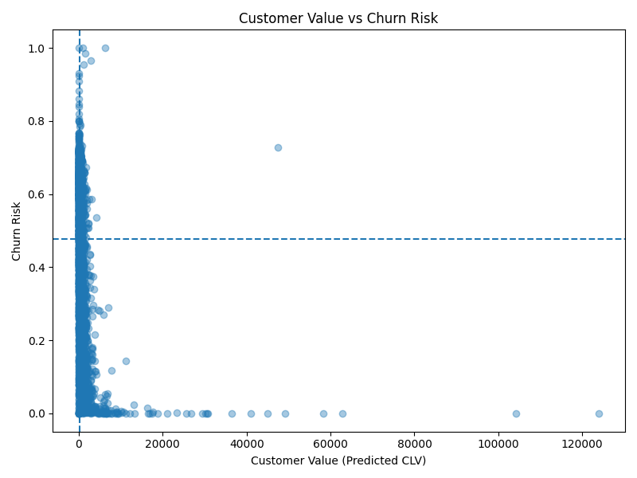

# 📊 E-commerce Churn Intelligence

End-to-end customer retention decision engine combining churn prediction, customer lifetime value (CLV) modeling, next-best-action recommendations, ROI simulation and business decision support.

---

## 🚀 Project Overview

This project builds a complete customer retention intelligence system using transactional e-commerce data.

The objective is not only to predict churn, but also to:

* identify valuable customers
* prioritize retention efforts
* recommend actions
* estimate campaign profitability

The project follows a leakage-free snapshot methodology and transforms predictions into actionable business decisions.

---

## 🖥️ Dashboard Preview

Interactive Streamlit dashboard for exploring:

* churn risk
* customer value (CLV)
* retention actions
* campaign ROI
* next-best-action recommendations



---

## ⚙️ Pipeline Architecture

```text
Raw Data
    ↓
Feature Engineering
    ↓
Churn Prediction
    ↓
CLV Prediction
    ↓
Priority Scoring
    ↓
Segmentation
    ↓
Next Best Action
    ↓
Channel & Timing
    ↓
ROI Simulation
    ↓
Dashboard
```

---

## 🧠 Problem Statement

Customer churn is one of the biggest challenges in e-commerce.

The project answers:

* Which customers are likely to churn?
* Which customers are valuable?
* Who should be targeted first?
* What action should be taken?
* Is the retention campaign financially justified?

---

## 📈 Model Performance

Leakage-free snapshot validation.

```text
ROC AUC: ~0.72
Accuracy: ~0.65
Precision: ~0.59
Recall: ~0.61
F1 Score: ~0.60
```

Models compared:

* Logistic Regression
* CatBoost

Selected model:

```text
Logistic Regression
```

---

## 📊 Feature Importance



Main churn drivers include:

* recency
* spending patterns
* purchasing activity trends
* customer value metrics

---

## 💰 CLV-Based Retention Priority

Priority score combines churn probability and predicted customer value.

```text
priority_score = churn_score × predicted_clv
```

This helps identify customers who are:

* likely to churn
* highly valuable

---

## 📊 Value vs Risk Matrix



Customers are segmented by:

* predicted value
* churn risk

### Interpretation

* High Value + High Risk → immediate action
* High Value + Low Risk → loyalty programs
* Low Value + High Risk → lower priority

---

## 🎯 Retention Strategy Layer

The system recommends actions for each customer segment.

| Segment                | Recommended Action |
| ---------------------- | ------------------ |
| HIGH_VALUE_HIGH_RISK   | offer_discount     |
| HIGH_VALUE_MEDIUM_RISK | personal_offer     |
| HIGH_VALUE_LOW_RISK    | loyalty_program    |
| MEDIUM_VALUE_HIGH_RISK | email_campaign     |
| LOW_VALUE_HIGH_RISK    | low_priority       |
| Other                  | no_action          |

Each recommendation includes a business explanation for better decision transparency.

### Example

| CustomerID | Segment                | Action          |
| ---------- | ---------------------- | --------------- |
| 16532      | HIGH_VALUE_HIGH_RISK   | offer_discount  |
| 12435      | HIGH_VALUE_MEDIUM_RISK | personal_offer  |
| 12409      | HIGH_VALUE_LOW_RISK    | loyalty_program |

---

## 🚀 Next Best Action (NBA v2)

The system extends recommendations by defining:

* action
* communication channel
* timing

### Example

| Segment                | Action          | Channel    | Timing |
| ---------------------- | --------------- | ---------- | ------ |
| HIGH_VALUE_HIGH_RISK   | offer_discount  | email      | 24h    |
| HIGH_VALUE_MEDIUM_RISK | personal_offer  | sales_call | 48h    |
| HIGH_VALUE_LOW_RISK    | loyalty_program | app        | 7d     |

This transforms predictions into actionable retention plans.

---

## 💸 Campaign ROI Simulation

The project estimates whether retention actions are financially justified.

For each customer the system calculates:

* campaign cost
* expected retained value
* expected profit
* estimated ROI

### Formula

```text
expected_retention_value = predicted_clv × churn_score

expected_profit = expected_retention_value - campaign_cost

ROI = expected_profit / campaign_cost
```

### Example Costs

| Action          | Cost |
| --------------- | ---- |
| offer_discount  | 200  |
| personal_offer  | 120  |
| loyalty_program | 60   |
| email_campaign  | 20   |

### Business Value

The system helps prioritize retention campaigns not only by risk, but also by expected financial return.

---

## 🗄️ SQL Data Layer

The project includes SQL-ready data extraction capabilities.

Example query:

```sql
SELECT
    CustomerID,
    COUNT(DISTINCT InvoiceNo) AS frequency_orders,
    SUM(Quantity * UnitPrice) AS monetary_total,
    MAX(InvoiceDate) AS last_purchase
FROM transactions
GROUP BY CustomerID;
```

Additional module:

```text
src/database.py
```

Provides:

* SQL data loading
* database integration
* prediction export

---

## 🖥️ Streamlit Dashboard

Interactive dashboard built with Streamlit.

Features:

* customer overview
* churn monitoring
* CLV analysis
* retention recommendations
* ROI monitoring

Run:

```bash
streamlit run app/dashboard.py
```

---

## 📁 Project Structure

```text
ecommerce-churn-intelligence/
│
├── app/
│   └── dashboard.py
│
├── data/
│   └── raw/
│       └── Online_Retail.csv
│
├── images/
│   └── dashboard.png
│
├── sql/
│   └── customer_features.sql
│
├── src/
│   ├── config.py
│   ├── database.py
│   ├── load_data.py
│   ├── churn_label.py
│   ├── features.py
│   ├── modeling.py
│   ├── clv.py
│   ├── decisioning.py
│   ├── strategy.py
│   ├── roi.py
│   ├── plots.py
│   └── run_pipeline.py
│
├── outputs/
│   ├── customer_features.csv
│   ├── churn_priority_table.csv
│   ├── feature_importance.csv
│   ├── feature_importance.png
│   ├── value_risk_matrix.png
│   └── model_metrics.json
│
├── README.md
└── requirements.txt
```

---

## ▶️ How to Run

Install dependencies:

```bash
pip install -r requirements.txt
```

Run pipeline:

```bash
python -m src.run_pipeline
```

Run dashboard:

```bash
streamlit run app/dashboard.py
```

---

## 📦 Outputs

Generated files:

* customer_features.csv
* churn_priority_table.csv
* feature_importance.csv
* feature_importance.png
* value_risk_matrix.png
* model_metrics.json

---

## 💡 Business Value

The project transforms customer analytics into actionable business decisions.

Capabilities:

* churn prediction
* customer value estimation
* retention prioritization
* next-best-action recommendations
* campaign ROI estimation
* decision support

---

## 🔗 Related Project

Customer Lifetime Value (CLV) project:

https://github.com/Coltrane35/customer-lifetime-value-retail

---

## 🔮 Future Improvements

* LLM-powered explanations
* online deployment
* campaign optimization
* real-time scoring
* advanced customer segmentation

---

## 👨‍💻 Author

Grzegorz Rączka

---

## ⭐ Key Takeaway

❌ Simple churn prediction

↓

✅ Customer Retention Decision Engine

Combining:

* churn prediction
* CLV modeling
* segmentation
* next best action
* ROI simulation
* dashboard analytics
